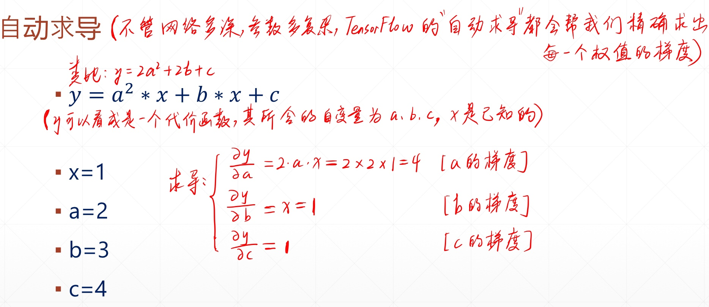

[TOC]

### 1. 例子


### 2. 程序

```python
import tensorflow as tf

x = tf.constant(1.)
a = tf.constant(2.)
b = tf.constant(3.)
c = tf.constant(4.)

with tf.GradientTape() as tape:
    tape.watch([a, b, c])
    y = a**2 * x + b * x + c

[dy_da, dy_db, dy_dc] = tape.gradient(y, [a, b, c])
print(float(dy_da), float(dy_db), float(dy_dc))
```

### 3. 运行结果

4.0 1.0 1.0

