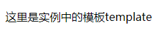
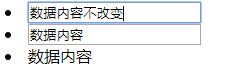

[TOC]
## 一. Vue.js简介

Vue.js是当下很火的一个**JavaScript MVVM**库，它是以**数据驱动**和**组件化**的思想构建的。相比于Angular.js，Vue.js提供了更加简洁、更易于理解的API，使得我们能够快速地上手并使用。

<br/>

***

## 二. Vue.js官方文档

[中文版](https://cn.vuejs.org/v2/guide/)

[英文版](https://vuejs.org/v2/guide/index.html)

<br/>

***

## 三. 在项目中引入Vue.js

### 1. 方法一

在官网下载vue.js文件并放置到项目中，之后直接在项目的html文件中\<head>的\<script>标签中引入。如下所示：

```html
<head>
    <meta charset="UTF-8">
    <title>Vue入门</title>
    <script src="./vue.js"></script>
</head>
```

### 2. 方法二（推荐）

引用CDN：

```html
<head>
    <meta charset="UTF-8">
    <title>Vue入门</title>
    <script src="https://cdn.jsdelivr.net/npm/vue/dist/vue.js"></script>
</head>
```

<br/>

***

## 四. 挂载点、模板、实例

* **挂载点**：某个带有id的页面标签，可以挂载Vue实例。
* **模板**：挂载点里面的内容，也可以放到Vue实例中。
* **实例**：JavaScript中new出来的Vue实例对象。

模板可以写到挂载点内部和实例中，但是实例中的模板会覆盖掉挂载点内部的模板。

### 1. eg1

```html
<!DOCTYPE html>
<html lang="en">
<head>
    <meta charset="UTF-8">
    <title>Vue入门</title>
    <script src="https://cdn.jsdelivr.net/npm/vue/dist/vue.js"></script>
</head>
<body>
    <!--挂载点-->
    <div id="root">{{msg1}}
        <p>这里是挂载点内部的模板{{msg2}}</p>
    </div>

    <script>
        // vue实例
        new Vue({
            // 指定实例的挂载点，指定Vue去接管哪个元素的内容，绑定DOM节点
            el: "#root",
            // 数据内容
            data: {
                msg1: "hello world",
                msg2: "template"
            }
        });
    </script>
</body>
</html>
```

**运行结果**：


### 2. eg2

```html
<!DOCTYPE html>
<html lang="en">
<head>
    <meta charset="UTF-8">
    <title>Vue入门</title>
    <script src="https://cdn.jsdelivr.net/npm/vue/dist/vue.js"></script>
</head>
<body>
    <div id="root">{{msg1}}
        <p>这里是挂载点内部的模板{{msg2}}</p>
    </div>

    <script>
        new Vue({
            el: "#root",
          	// 覆盖掉挂载点中的模板内容
            template: '<p>这里是实例中的模板{{msg2}}</p>',
            data: {
                msg1: "hello world",
                msg2: "template"
            }
        });
    </script>
</body>
</html>
```

**运行结果**：




<br/>

***

## 五. Vue实例中的数据

* 数据对象：data；
* 页面可以引用实例中的数据内容；
* **{{}}** 为插值表达式语法；
* **v-text** ：Vue指令，只能输出文本，会转义；
* **v-html** ：Vue指令，可以输出标签，不转义。

**eg**：

```html
<body>
    <div id="root">
        <li>{{msg1}}</li>
        <li v-text="msg2"></li>
        <li v-html="msg2"></li>
    </div>

    <script>
        new Vue({
            el: "#root",
            data: {
                msg1: "{{}}插值表达式",
                msg2: "<i>测试v-text与v-html的不同</i>"
            }
        });
    </script>
</body>
```

 **运行结果**：


<br/>

***

## 六. 事件与方法

* 给元素绑定事件：使用**v-on：** 指令（简写为 **@**），监听 DOM 事件，并在触发时运行一些 JavaScript 代码；
* 函数对象：methods；
* Vue的特点：面向数据编程，不需要操作DOM节点，数据改变，页面随即改变；
* 改变挂载点中的内容不需要操作DOM（findElementById），只需修改Vue实例中的数据对象。

**eg**：

```html
<body>
    <div id="root">
        <li v-on:click="handleClick">{{msg1}}</li>
        <li @click="changeData">{{msg2}}</li>
    </div>

    <script>
        new Vue({
            el: "#root",
            data: {
                msg1: "请点我",
                msg2: "点我改变内容"
            },
            methods: {
                handleClick: function() {
                    alert('method对象绑定')
                },
                changeData: function() {
                    this.msg2="内容被改变"
                }
            }
        });
    </script>
</body>
```

<br/>

***

## 七. 属性绑定

* 属性绑定使用模板指令**v-bind:title='变量名或js表达式'** 或者 **:title='变量名或js表达式'** ；
* 其中，**变量名**是Vue实例的data数据对象中的某个属性；
* 该模板指令实际上替换了原来html的title属性（title 属性规定关于元素的额外信息，这些信息通常会在鼠标移到元素上时显示一段工具提示文本），而且是它的升级版。

**eg**：

```html
<body>
    <div id="root">
       <li title="实例中的数据">鼠标移动过来显示</li>
       <li v-bind:title="title">鼠标移动过来显示</li>
       <li :title="'这是一个' + title">鼠标移动过来显示</li>
    </div>

    <script>
        new Vue({
            el: "#root",
            data: {
               title: "实例中的数据"
            }
        });
    </script>
</body>
```

**运行结果**：


<br/>

***


## 八. 双向数据绑定

* 单向绑定：使用模板指令 **:value** ，数据决定页面的显示（数据改变，则页面改变），页面无法决定数据中的内容；
* 双向绑定：使用模板指令 **v-model** ，页面和数据内容任何一个改变，另一个也改变。

**eg**：

```html
<body>
    <div id="root">
       <li><input :value="content"/></li>
       <li><input v-model="content"/></li>
       <li>{{content}}</li>
    </div>

    <script>
        new Vue({
            el: "#root",
            data: {
               content: "数据内容"
            }
        });
    </script>
</body>
```

**运行结果**：



<br/>

***

## 九. 计算属性和侦听器

* computed(计算属性对象)：其属性由其他属性计算得来。其中，若其他依赖属性没有变化，则会使用缓存值，不重新计算，提高性能体验；
* watch(侦听器对象)：监听数据变化，数据被改变则触发。

```html
<body>
    <div id="root">
        <li>姓：<input v-model="lastName" /></li>
        <li>名：<input v-model="firstName"></li>
        <li>{{lastName}}{{firstName}}</li>
        <li>数据属性变化次数：{{count}}</li>
        <li>计算属性变化次数：{{fullCount}}</li>
    </div>

    <script>
        new Vue({
            el: "#root",
            data: {
                lastName: "",
                firstName: "",
                count: 0,
                fullCount: 0
            },
            computed: {
                fullName: function () {
                    return this.lastName + this.firstName;
                }
            },
            watch: {
                // 监听数据属性
                lastName: function () {
                    this.count++;
                },
                // 监听数据属性
                firstName: function () {
                    this.count++;
                },
                // 监听计算属性
                fullName: function () {
                    this.fullCount++;
                }
            }
        });
    </script>
</body>
```

<br/>

***

## 十. v-if、v-show、v-for指令

* **v-if**：控制DOM的存在与否，为false时直接删除标签DOM；
* **v-show**：控制DOM的显示与否，为false时隐藏标签DOM；
* **v-for**：遍历数据，循环展示数据，增加 **:key='item'** 可以提升效率，但是key值需互不相同。

**eg**：

```html
<body>
    <div id="root">
        <ul>
            <li>
                <p v-if="show">hello world!</p>
            </li>
            <li>
                <p v-show="show">hello world!</p>
            </li>
            <li>
                <button @click="handleClick">切换</button>
            </li>
        </ul>

        <ul>
            <li v-for="item of list">{{item}}</li>
        </ul>

        <ul>
            <li v-for="(item, index) of list" :key="index">{{item}}</li>
        </ul>
    </div>

    <script>
        new Vue({
            el: "#root",
            data: {
                show: true,
                list: [1, 2, 3]
            },
            methods: {
                handleClick: function () {
                    this.show = !this.show;
                }
            }
        });
    </script>
</body>
```

**运行结果**：

